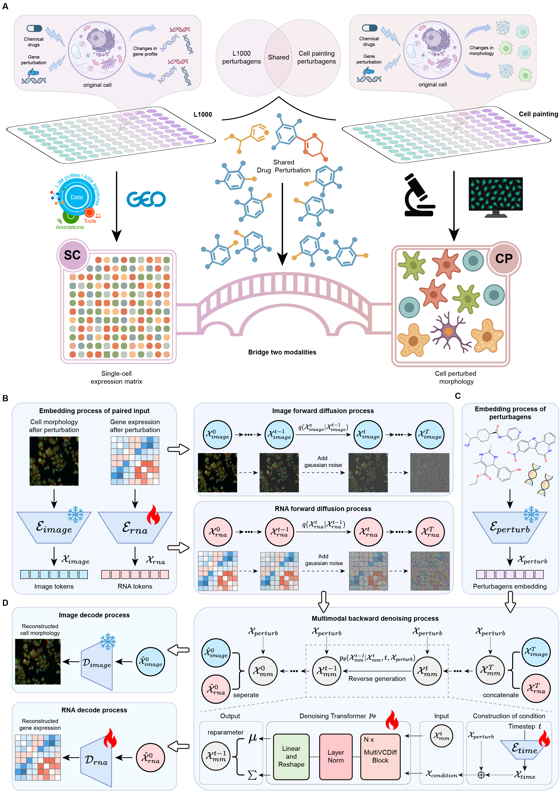

# MultiVCDiff: Building a Generative Virtual Cell by Multimodally Predicting Morphological and Transcriptomic Perturbation Responses

> ✨ A unified multimodal diffusion model for simultaneously generating cellular morphology and transcriptomics under drug perturbations.

-----

## Overview

**MultiVCDiff** is a unified multimodal diffusion model capable of simultaneously generating cellular morphology images and transcriptomic profiles under drug perturbations. By learning the conditional joint distribution of morphology and gene expression, MultiVCDiff achieves a more faithful and robust representation of cellular states than single-modality approaches. Our model not only achieves state-of-the-art fidelity in both image and transcriptomic generation but also demonstrates strong cross-modal coherence and generalizes to unseen drugs. MultiVCDiff represents a critical step toward building practical **AI Virtual Cell (AIVC)** platforms that support high-throughput, reproducible *in silico* experimentation, with significant promise for accelerating drug discovery and repurposing.

-----

## Why MultiVCDiff?

  - 🧬 **True Multimodal Synthesis**: Simultaneously generates both high-content morphology images and high-dimensional transcriptomic profiles from a single drug perturbation.
  - 🖼️ **High-Fidelity Morphology**: Accurately captures complex, drug-specific phenotypes, such as microtubule depolymerization, that baseline models fail to reproduce.
  - 📊 **Biologically Interpretable Transcriptomics**: Precisely predicts gene expression changes that align with known drug mechanisms of action (MOA), such as identifying apoptosis pathways for camptothecin.
  - 🔗 **Cross-Modal Coherence**: Learns the intrinsic links between molecular programs and phenotypic changes, enabling more accurate predictions and cross-modal completion when one modality is missing.
  - 🏆 **Superior Performance**: Significantly outperforms state-of-the-art, single-modality models on their own specialized tasks, highlighting the synergistic benefit of joint multimodal learning.
  - 💊 **Generalizes to Novel Drugs**: Demonstrates powerful generalization to unseen compounds, making it a viable tool for *in silico* screening and drug discovery.



-----

## Quick Links

- [Installation](#installation)
- [CPgenes Dataset](#cpgenes-dataset)
- [Training](#training)
- [Todo list](#todo-list)
- [Contact](#contact)

-----

## Installation

1.  Clone the repository to your local machine:

    ```bash
    git clone https://github.com/prsigma/MultiVCDiff.git
    cd MultiVCDiff
    ```

2.  Create and activate a new conda environment using the provided file:

    ```bash
    conda env create -f environment.yaml
    conda activate MultiVCDiff
    ```

**Note**: Please ensure your system has a compatible version of CUDA installed to leverage GPU acceleration for model training.

-----

## CPgenes Dataset

To train and evaluate MultiVCDiff, we curated and released **CPgenes**, a standardized trimodal corpus. This dataset contains **44,000 matched samples** across 44 small-molecule perturbations, bridging the L1000 (gene expression) and Cell Painting (morphology) assays.

  - **Morphology Data**: High-content images from the Cell Painting assay.
  - **Transcriptomics Data**: L1000 gene expression profiles.
  - **Perturbation Data**: Information on the 44 small-molecule drugs used.

The complete dataset, along with preprocessing pipelines, is available for download here: `https://drive.google.com/drive/folders/1nYKfKV_A-g0tXiJwbC7L6trT_WJAF50Y?usp=drive_link`

-----

## Training

We provide scripts to easily train the model and generate new predictions.

To train the MultiVCDiff model on the CPgenes dataset, run the training script:

```bash
# Activate the conda environment
conda activate MultiVCDiff

# Run the training script
bash pr_run.sh
```

Checkpoints will be saved to the `results_multimodal/` directory.

-----

## Todo List

  - [ ] Upload the inference code.
  - [ ] Provide a detailed tutorial notebook for training, inference, and evaluation.

-----

## Contact

If you have any questions, find a bug, or have suggestions for improvement, please email `prchengdu@gmail.com` or open an issue in this GitHub repository.